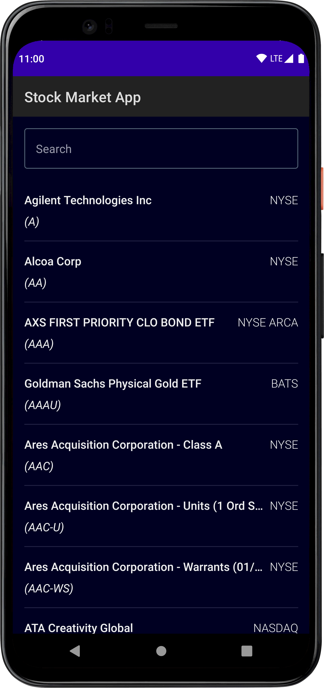
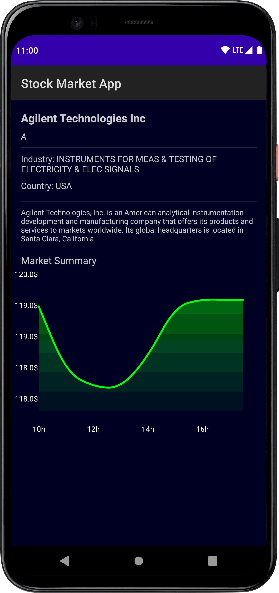

# Stock Market App

This app uses Android Compose and the [Alpha Vantage](https://www.alphavantage.co/) API to provide stock market
information.

It displays a list of publicly traded companies, and provide more detailed information about each one of
them when they are selected:

- The name and description of the company among other things.
- A graph showing the evolution of the stock price of that company.

## Images

## Credit

[Philipp Lackner](https://www.youtube.com/watch?v=uLs2FxFSWU4)